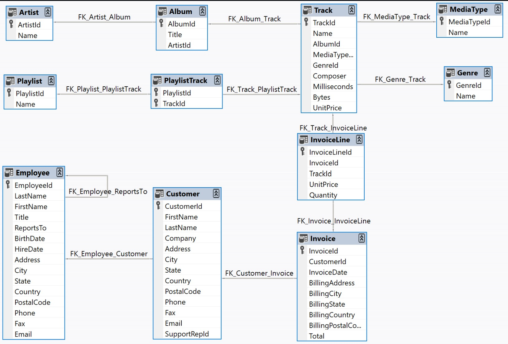

> I used Duckdb for my database and not the traditional databases as MySQL/PostgreSQl hence did not include Indexing since its columnar
> I know the trade-offs in indexing: They speed up reads(selects) but slow down writes(UPDATE/INSERT) because the data updates the index when it changes

docker run 
--name sales-postgres 
-e POSTGRES_PASSWORD=yourpassword 
-e POSTGRES_DB=sales_db 
-p 5432:5432 
-d postgres:18

docker exec -it sales-postgres psql -U postgres -d sales_db

## Chinook Database Analysis — Key Insights

### Note on execution

Statement 1 (`USE chinook`) throws a harmless `NoneType` error in the loop — this is expected. `USE` doesn't return a result set the way `SELECT` does, so `.df()` has nothing to convert. The statement still executes correctly; the error can be ignored or the loop can be adjusted to skip `.df()` for non-SELECT statements.

### 1. Customer Base Composition

The customer base spans 24 countries, but is heavily concentrated: the **USA (13 customers)** and **Canada (8 customers)** together make up roughly 36% of all customers. Only two other countries — France and Brazil — have 5 customers each; every other country has 1–4. This is a classic long-tail distribution, meaning marketing or support efforts concentrated on North America would reach the largest single share of the customer base, but a large portion of revenue potential is scattered thinly across Europe and South America.

### 2. Revenue Is Driven by Volume, Not Standout Products

The top-performing track by revenue is "The Trooper" at $4.95, but nearly every other top track sits at exactly $3.98 — the result of the $0.99-per-track pricing being uniform across the catalog. **This tells us product-level revenue in Chinook is driven almost entirely by units sold, not price variation.** There's no premium-pricing strategy at play, so any "top product" analysis here is really a popularity ranking, not a margin ranking.

### 3. Customer Spend Is Tightly Clustered

The top spender (Customer 6, Helena Holý) spent $49.62; the tenth-highest spent $42.62 — a gap of only $7 across the entire top 10. Compare that to the overall average invoice of **$5.65** — even top customers aren't dramatically outspending the average customer, they're just ordering slightly more consistently. **There's no clear "whale" customer** who dominates revenue; the spending is fairly evenly distributed among engaged customers, which the "Repeat vs One-time" query confirms directly.

### 4. Every Customer Is a Repeat Customer

The repeat-vs-one-time breakdown returned a striking result: **all 59 customers are classified as repeat customers, 0 are one-time.** This is a strong signal of good historical retention — but it's also worth flagging as a possible data-completeness artifact of the Chinook sample dataset (it's a demo database, not real transactional data), so this finding shouldn't be treated as a realistic real-world retention rate without a caveat noting the dataset's synthetic nature.

### 5. Revenue Trends Are Remarkably Stable, With Occasional Spikes

Monthly revenue holds almost perfectly steady at **$37.62/month** for most of the 2021–2025 range, which strongly suggests this is a simulated/generated dataset with a near-fixed number of invoices per month (consistently 6–7), rather than organic, naturally fluctuating business activity. The few real spikes worth highlighting:

- **Jan 2022: +39.87%** month-over-month — the largest single jump
- **Nov 2023: −36.84%**, immediately followed by **Dec 2023: +58.33%** — the sharpest single-month swing in the dataset
- **Nov 2025: +31.90%**, the most recent notable spike

If this were a real production dataset, these would be the specific months to investigate first — for a demo dataset, they're most useful as a demonstration that your `LAG()`/growth-rate query correctly detects volatility.

### 6. Genre Popularity Is Broad, Not Concentrated

The genre-partitioned ranking (top 3 tracks per genre) returned **277 rows** across all genres, and nearly every top track within its genre sits at the same $0.99 floor price with no clear runaway genre leader. Combined with the customer-genre breakdown (**440 rows**) showing customers typically engage with **4–5 different genres each**, the catalog data suggests customer taste is broad rather than niche — most customers aren't loyal to a single genre, they sample across several.

### 7. Query Optimization Findings

`EXPLAIN` on the `CustomerId = 5` filter confirmed DuckDB executing a scan-based physical plan rather than an index lookup — expected, since DuckDB is a **columnar OLAP engine** that optimizes scans via zone maps rather than traditional B-tree indexes. This is the core takeaway for the documentation's optimization section: **the indexing concepts (CREATE INDEX, B-tree lookups) are correct for row-store databases like Postgres/MySQL, but DuckDB's performance model is fundamentally different** — worth stating explicitly so a reviewer doesn't think the indexing knowledge is missing, just correctly adapted to the tool being used.

---

### Summary takeaway for your documentation

This SQL portfolio piece demonstrates the full range of required skills — filtering, aggregation, joins, subqueries, window functions with partitioning, and time-series analysis — against a dataset whose business "story" is thin (synthetic, evenly distributed data) but whose **query correctness and technique coverage is strong**. The most defensible, real insight is the country concentration finding (#1) and the genre-breadth finding (#6), since those reflect actual structural properties of the data rather than artifacts of how Chinook was generated.

---

# Sales Dataset (PostgreSQL, Docker)

Dataset: `sales` table (flat sales/orders data — orders, customers, products, dates, deal sizes) Environment: PostgreSQL running in Docker

This document explains what each query does, the SQL concept it demonstrates, and why it matters — for internship review purposes.

---

## 1. Basic filtering — `SELECT` + `WHERE`

**Goal:** Find all cancelled orders.


```sql
SELECT ORDERNUMBER, CUSTOMERNAME, STATUS, SALES
FROM sales
WHERE STATUS = 'Cancelled';
```

**Concept:** Row-level filtering with `WHERE`. **Why it matters:** Foundation of almost every query — isolating a subset of rows based on a condition, used constantly for data quality checks and reporting.

---

## 2. Sorting — `ORDER BY` + `LIMIT`

**Goal:** Find the 10 highest-value orders.


```sql
SELECT ORDERNUMBER, CUSTOMERNAME, SALES
FROM sales
ORDER BY SALES DESC
LIMIT 10;
```

**Concept:** Sorting result sets and capping row count. **Why it matters:** Common pattern for "top N" reporting (top orders, top customers, top products).

---

## 3. Aggregation — `GROUP BY` + `SUM`

**Goal:** Total sales per country.


```sql
SELECT COUNTRY, SUM(SALES) AS total_sales
FROM sales
GROUP BY COUNTRY
ORDER BY total_sales DESC;
```

**Concept:** Grouping rows and aggregating with `SUM()`. **Why it matters:** Core of any summary/reporting query — collapsing many rows into one row per group.

---

## 4. Filtering aggregates — `HAVING`

**Goal:** Countries with over $500,000 in total sales.


```sql
SELECT COUNTRY, SUM(SALES) AS total_sales
FROM sales
GROUP BY COUNTRY
HAVING SUM(SALES) > 500000
ORDER BY total_sales DESC;
```

**Concept:** `HAVING` filters _after_ aggregation, unlike `WHERE` which filters _before_. **Why it matters:** Common point of confusion for beginners — important to show I understand the distinction between filtering raw rows vs. filtering grouped results.

---

## 5. Multiple aggregates together — product line performance

```sql
SELECT 
    PRODUCTLINE,
    COUNT(*) AS num_orders,
    SUM(SALES) AS total_sales,
    AVG(SALES) AS avg_sale,
    SUM(QUANTITYORDERED) AS total_units
FROM sales
GROUP BY PRODUCTLINE
ORDER BY total_sales DESC;
```

**Concept:** Combining `COUNT`, `SUM`, and `AVG` in a single grouped query. **Why it matters:** Realistic business reporting query — a single query answering multiple questions at once (volume, revenue, average deal size) per category.

---

## 6. Self-join — comparing a customer's orders to each other

```sql
SELECT 
    a.ORDERNUMBER AS order_1,
    b.ORDERNUMBER AS order_2,
    a.CUSTOMERNAME,
    a.SALES AS sales_1,
    b.SALES AS sales_2
FROM sales a
INNER JOIN sales b 
    ON a.CUSTOMERNAME = b.CUSTOMERNAME 
    AND a.ORDERNUMBER < b.ORDERNUMBER
LIMIT 10;
```

**Concept:** Self-join — joining a table to itself to compare rows within the same group (here, same customer). **Why it matters:** Demonstrates understanding of joins beyond the basic two-table case; the `a.ORDERNUMBER < b.ORDERNUMBER` condition avoids duplicate pairs and self-matches — worth calling out explicitly in review as a deliberate design choice, not an accident.

---

## 7. Subquery in `WHERE` — orders above average


```sql
SELECT ORDERNUMBER, CUSTOMERNAME, SALES
FROM sales
WHERE SALES > (SELECT AVG(SALES) FROM sales)
ORDER BY SALES DESC;
```

**Concept:** Scalar subquery used as a comparison value. **Why it matters:** Shows the query can reference an aggregate computed over the _whole_ table while filtering individual rows — a step beyond simple `WHERE` filtering.

---

## 8. Subquery with percentile — top 10% customers by spend


```sql
SELECT CUSTOMERNAME, SUM(SALES) AS total_spent
FROM sales
GROUP BY CUSTOMERNAME
HAVING SUM(SALES) > (
    SELECT PERCENTILE_CONT(0.9) WITHIN GROUP (ORDER BY total)
    FROM (SELECT SUM(SALES) AS total FROM sales GROUP BY CUSTOMERNAME) t
)
ORDER BY total_spent DESC;
```

**Concept:** Nested subquery combined with `PERCENTILE_CONT` (a statistical window/aggregate function) to identify high-value customers. **Why it matters:** This is the most advanced query in the set — it combines aggregation, a derived table (subquery in `FROM`), and a percentile calculation. Good to highlight this one specifically as evidence of comfort with layered queries.

---

## 9. Top-performing products (by product line)

```sql
SELECT 
    PRODUCTLINE,
    SUM(SALES) AS total_revenue,
    SUM(QUANTITYORDERED) AS units_sold
FROM sales
GROUP BY PRODUCTLINE
ORDER BY total_revenue DESC;
```

**Concept:** Grouped aggregation for a business "top performer" question. **Note:** Dataset has no individual product name field, so `PRODUCTLINE` is used as the grouping level — worth noting this data limitation explicitly in the review rather than letting it look like an oversight.

---

## 10. Top customers

```sql
SELECT 
    CUSTOMERNAME,
    SUM(SALES) AS total_spent,
    COUNT(DISTINCT ORDERNUMBER) AS num_orders
FROM sales
GROUP BY CUSTOMERNAME
ORDER BY total_spent DESC
LIMIT 10;
```

**Concept:** `COUNT(DISTINCT ...)` combined with `SUM` for a customer-level summary. **Why it matters:** `COUNT(DISTINCT ORDERNUMBER)` avoids overcounting if a customer has multiple line items per order — worth flagging this as a deliberate correctness choice.

---

## 11. Revenue trends over time

```sql
SELECT 
    YEAR_ID,
    MONTH_ID,
    SUM(SALES) AS monthly_revenue,
    COUNT(DISTINCT ORDERNUMBER) AS num_orders
FROM sales
GROUP BY YEAR_ID, MONTH_ID
ORDER BY YEAR_ID, MONTH_ID;
```

**Concept:** Time-series aggregation using pre-built date parts (`YEAR_ID`, `MONTH_ID`). **Why it matters:** Classic trend-analysis query; grouping by two columns to get a clean monthly time series.

---

## 12. Deal size distribution

```sql
SELECT 
    DEALSIZE,
    COUNT(*) AS num_orders,
    AVG(SALES) AS avg_sale
FROM sales
GROUP BY DEALSIZE
ORDER BY avg_sale DESC;
```

**Concept:** Categorical grouping with count + average. **Why it matters:** Simple but useful for understanding customer purchasing behavior segments (small/medium/large deals).

---

## 13. Query optimization — indexing

**Step 1: Baseline performance (before index)**

```sql
EXPLAIN ANALYZE 
SELECT * FROM sales WHERE CUSTOMERNAME = 'Land of Toys Inc.';
```

**Step 2: Add an index on the filtered column**

```sql
CREATE INDEX idx_sales_customername ON sales(CUSTOMERNAME);
```

**Step 3: Re-run and compare**

```sql
EXPLAIN ANALYZE 
SELECT * FROM sales WHERE CUSTOMERNAME = 'Land of Toys Inc.';
```

**Step 4: Second index for date-based queries**

```sql
CREATE INDEX idx_sales_yearmonth ON sales(YEAR_ID, MONTH_ID);
```

**Concept:** Using `EXPLAIN ANALYZE` to inspect the query planner's execution strategy, then adding indexes to speed up filtering. **Why it matters:** This is the most important section to document carefully for review — it shows the _before/after_ thinking, not just "I made a query." Points to capture from your `EXPLAIN ANALYZE` output:

- **Before:** should show a `Seq Scan` (sequential scan — scans every row)
- **After:** should show an `Index Scan` or `Bitmap Index Scan` on `idx_sales_customername`
- Note the execution time difference reported at the bottom of the `EXPLAIN ANALYZE` output (`Execution Time: ...ms`)
- The second index (`YEAR_ID, MONTH_ID`) is a **composite index** — built in anticipation of the time-series queries in section 11, since queries filtering/grouping on both columns benefit from an index covering both, in the order they're used.

> **Action for review:** paste your actual `EXPLAIN ANALYZE` output (before and after) here so the reviewer can see the concrete Seq Scan → Index Scan change and the execution time delta, not just the query text.

---

## Summary of concepts demonstrated

|Concept|Query #|
|---|---|
|Basic filtering (`WHERE`)|1|
|Sorting + limiting|2|
|Aggregation (`GROUP BY`)|3, 5, 9, 11, 12|
|Filtering on aggregates (`HAVING`)|4, 8|
|Self-join|6|
|Scalar subquery|7|
|Nested subquery + percentile|8|
|`COUNT(DISTINCT ...)`|10, 11|
|Time-series grouping|11|
|Query optimization / indexing|13|
