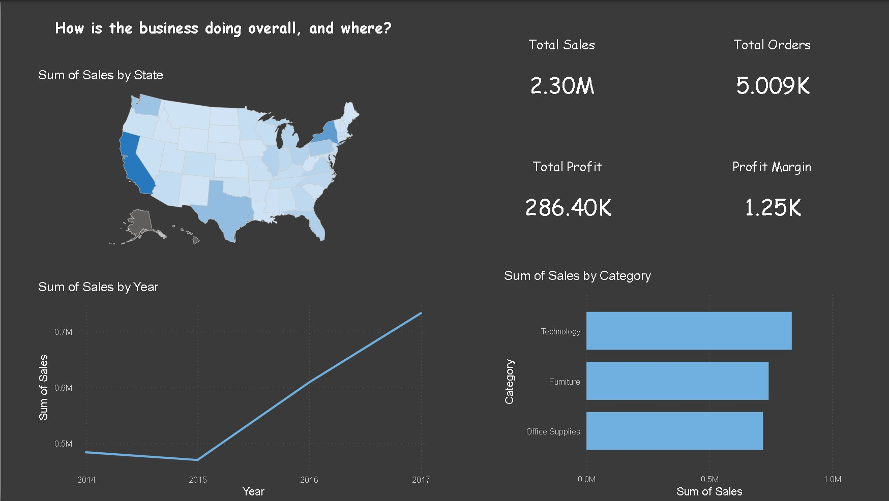
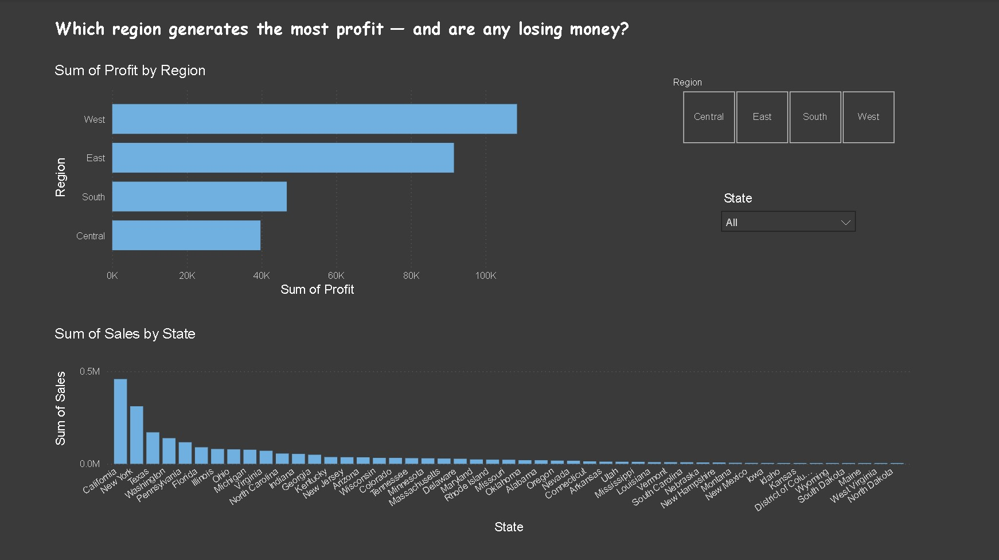
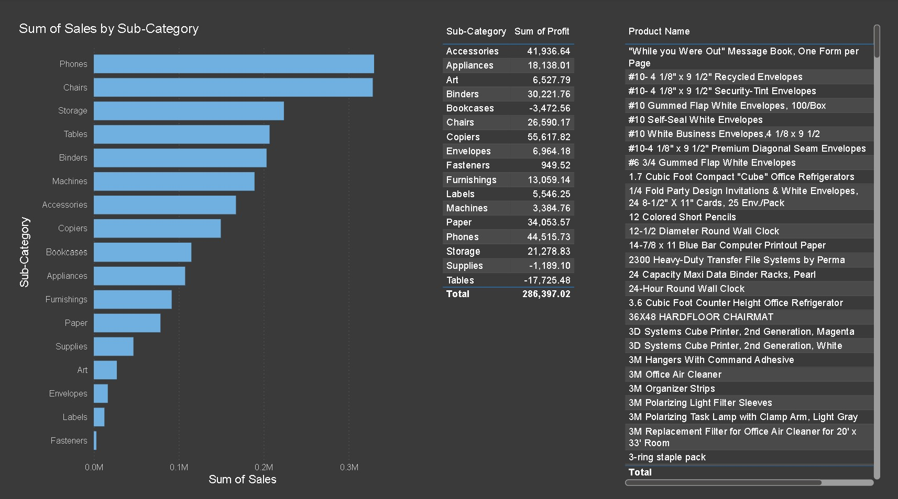
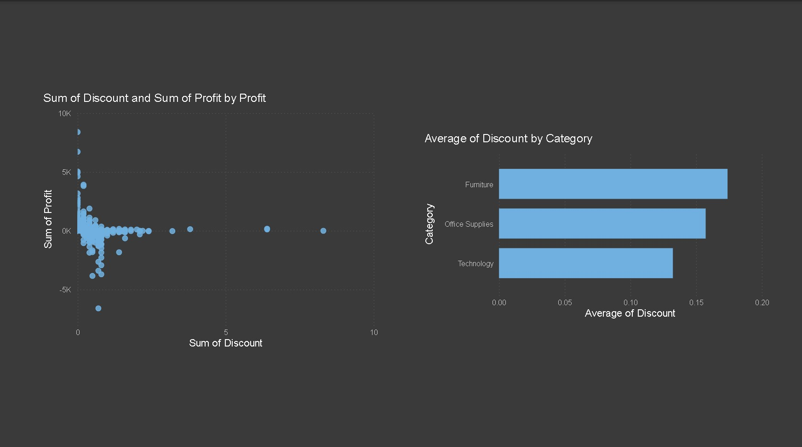
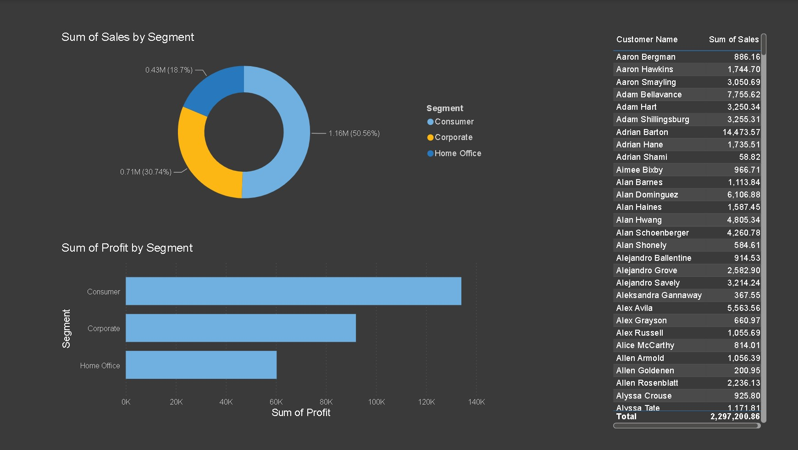

## Week 4 — Business Intelligence Dashboard

### Task Requirements (Reference)

**Dataset:** Superstore (sales) — chosen over COVID-19  
**Tool:** Power BI

**5 steps completed:**

1. Explored the data — columns, missing values, date fields
2. Selected KPIs — Total Sales, Total Orders, Total Profit, Profit Margin, Sales by Region/Category
3. Built charts — bar charts, trend line, map, scatter plot
4. Added interactive filters — region buttons, state dropdown
5. Wrote insight statements per chart

**Deliverables:**

- Dashboard file (.pbix / screenshots)
- 5–10 slide deck
- LinkedIn post (#AnalystLabAfrica)

---

### Week 4 Review — Superstore Sales Analysis

#### What I Did

Built a 5-page Power BI dashboard analyzing the Superstore dataset (Kaggle: Superstore Dataset Final) — roughly 5,000 orders spanning 2014–2017. Instead of putting every visual on one page, I structured it around five specific business questions:

**Overview** — How is the business performing overall?

  

**Geography** — Which regions and states generate the most profit?

  

**Product Performance** — What's selling well vs. what's actually profitable?

  

**Discount Impact** — Is discounting helping close sales or eroding margin?

  

**Customer View** — Who are the highest-value customers and segments?

#### Key Findings

- Discounts above roughly 20% erase profit almost entirely, and Furniture — the category with the highest average discount — is the most exposed.
- Tables and Bookcases post negative total profit despite decent sales volume, while Copiers and Phones are strong profit performers relative to their sales.
- Sales nearly doubled from 2014 to 2017, but growth is concentrated in the West and East regions, and largely in California and New York.

#### What I Learned

- How to structure a dashboard around business questions instead of just charting available fields — one page, one job.
- That sales volume alone can be misleading; profit and discount need to be viewed together to catch losing product lines.
- How to use slicers and interactive filters to make a dashboard genuinely useful for exploration, not just static reporting.

#### What I Struggled With

- Deciding which visuals belonged on which page without overcrowding any single view.
- Getting the discount-vs-profit scatter plot to read clearly, since most points cluster tightly near zero discount.
- Translating raw chart output into plain-English business insights rather than just describing what each chart shows.

#### Deliverables

- 5-page interactive Power BI dashboard
- 11-slide presentation summarizing the analysis
- LinkedIn post on dashboard design decisions (#AnalystLabAfrica)